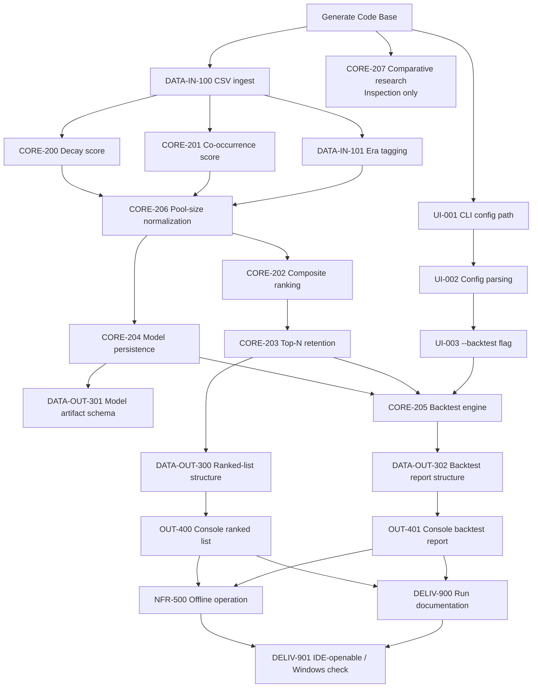

# Implementation Plan

<!--
Owned by the Systems Engineer, built in collaboration with Solutions
Architect's docs/PROJECT_DEFINITION.md. Sequences the build so the
most critical MVP items come first.
-->

Single linear priority order — a multi-phase (complexity/UI-quality/
documentation-rigor) split is not warranted here: LottoPicker is a
one-shot console CLI MVP with a single implementer role (Software
Engineer only; no UI/scene split — `docs/PROJECT_DEFINITION.md` Scope
confirms CLI-only, no GUI) and no expected growth into distinct
delivery phases.

Ordering reflects both inputs the role calls for:
- **Technical dependency/feasibility** (Solutions Architect's angle):
  taken directly from `docs/SDD.md`'s two-stage pipeline — Stage 1
  (ingest → era-tag → decay/co-occurrence → normalize → persist model)
  must exist before Stage 2 (composite → top-N → rank, and
  backtest) can run against it.
- **Client value** (Product Manager's angle): the core ranked-list
  output (SN-1, the Mission Statement's primary ask) is sequenced
  ahead of the backtest-validation feature (SN-2/SN-3) — both are
  confirmed MVP scope, but the ranking engine is the product; the
  backtest validates it and structurally cannot be built first since
  it re-runs the same scoring pipeline against truncated history.
  CORE-206/CORE-207 (SN-6's differentiator, SN-5's "whole point of the
  exercise") are sequenced early, immediately after the raw scores
  they refine, rather than deferred as polish.

## Build Sequence

1. **Generate Code Base** — CMake scaffolding, presets, directory
   layout, `.clang-format`, Catch2 via FetchContent, README skeleton.
   No RTVM item; everything below depends on it.
2. **UI-001** — CLI accepts the config-path argument; usage/error
   handling for missing/invalid path.
3. **DATA-IN-100** — CSV ingestion into in-memory draw records, with
   per-row malformed-data reporting.
4. **CORE-207** — Comparative research task. Already delivered as
   `docs/research/CORE-207-comparative-research.md`; this issue is
   its formal Inspection record. No code dependency — runs in
   parallel with everything else.
5. **UI-002** — Config file parsing (`data_file`, `top_n`) built on
   UI-001's CLI entry point.
6. **DATA-IN-101** — Per-draw pool-size era tagging, extending
   DATA-IN-100's ingested records.
7. **CORE-200** — Per-number frequency-decay score.
8. **CORE-201** — Co-occurrence scoring, groups of 2–6.
9. **UI-003** — `--backtest <dates>` CLI flag, extending UI-002.
10. **CORE-206** — Pool-size normalization (observed-minus-chance-
    expected), applied to CORE-200/CORE-201's raw scores using
    DATA-IN-101's era tags.
11. **CORE-202** — Composite ranking metric, combining CORE-206's
    normalized per-number and per-group scores.
12. **CORE-204** — Persist the derived statistical model (decay +
    co-occurrence scores) as a reusable artifact.
13. **CORE-203** — Top-N retention over the full ~22.9M-combination
    space without materializing it, using CORE-202's composite score.
14. **DATA-OUT-301** — Model artifact file schema, pairing CORE-204.
15. **DATA-OUT-300** — Ranked-list output structure, pairing CORE-203.
16. **CORE-205** — Backtest engine: truncate history to a sample
    date, re-run the model, report rank/percentile and containment.
17. **OUT-400** — Console presentation of the ranked list.
18. **DATA-OUT-302** — Backtest report structure, pairing CORE-205.
19. **OUT-401** — Console presentation of the backtest report.
20. **NFR-500** — Offline-operation inspection across the completed
    codebase.
21. **DELIV-900** — Run documentation (build steps, config example,
    launch command, sample output) — needs the finished, working
    example from OUT-400/OUT-401.
22. **DELIV-901** — IDE-openable deliverable: one-time Windows/Visual
    Studio consolidation-phase verification (per `docs/SDD.md`'s
    explicit target-platform decision) of the CMake project already
    established at step 1 — not gated per feature, sequenced last.

## Phases (only if warranted — see note above)

Not warranted for this project — see the opening note. A single
linear sequence (above) is sufficient.

## Sequence Diagram

## Issue mapping

Filled in immediately after the issues below were created (same run) —
maps each RTVM ID to its GitHub issue number for traceability.

| Step | RTVM ID(s) | Issue |
| --- | --- | --- |
| 1 | Generate Code Base | TBD |
| 2 | UI-001 | TBD |
| 3 | DATA-IN-100 | TBD |
| 4 | CORE-207 | TBD |
| 5 | UI-002 | TBD |
| 6 | DATA-IN-101 | TBD |
| 7 | CORE-200 | TBD |
| 8 | CORE-201 | TBD |
| 9 | UI-003 | TBD |
| 10 | CORE-206 | TBD |
| 11 | CORE-202 | TBD |
| 12 | CORE-204 | TBD |
| 13 | CORE-203 | TBD |
| 14 | DATA-OUT-301 | TBD |
| 15 | DATA-OUT-300 | TBD |
| 16 | CORE-205 | TBD |
| 17 | OUT-400 | TBD |
| 18 | DATA-OUT-302 | TBD |
| 19 | OUT-401 | TBD |
| 20 | NFR-500 | TBD |
| 21 | DELIV-900 | TBD |
| 22 | DELIV-901 | TBD |
