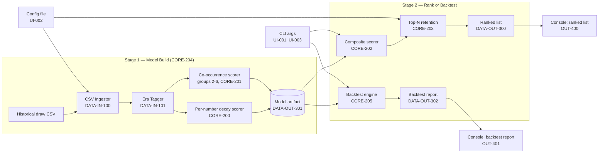
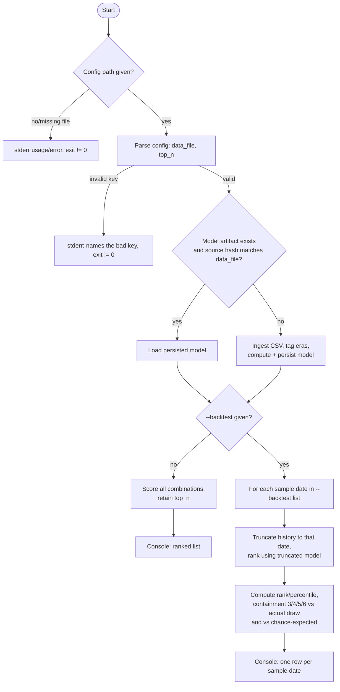

# Software Design Document (SDD)

<!--
Owned by the Systems Engineer, refined with the Software Engineer.
Describes the system architecture and the build/toolchain
conventions the codebase follows.
-->

## Architecture

LottoPicker is a single-process C++ CLI tool with no networked,
distributed, or multi-process components (see `docs/RTVM.md` NFR-500
— offline only). Requirement IDs below are `docs/RTVM.md`'s.

### Overview: two-stage pipeline, two run modes



Both run modes share Stage 1 unchanged (CORE-204: the model is a
reusable artifact, rebuilt only when the source CSV changes) and
diverge only after the model exists.

### Top-level control flow

Resolves UI-003 (invocation mechanism) and CORE-204 (reuse-vs-rebuild)
as concrete decisions rather than leaving them to Software Engineer to
improvise:



### Interfaces & file formats

No separate UI/service split exists in this project (CLI only, single
implementer — see `docs/PROJECT_DEFINITION.md` Scope), so a formal ICD
is not warranted per the menu in `systems-engineer.md`. These formats
are still fixed here as the concrete contract Software Engineer
implements against, and Test Engineer verifies against.

**CLI invocation** (resolves UI-003):
```
lottopicker <config-path> [--backtest <date1>[,<date2>,...]]
```
- `<config-path>` (positional, required): path to the config file.
- `--backtest <dates>`: comma-separated ISO-8601 dates (`YYYY-MM-DD`).
  When present, runs the backtest path (CORE-205) once per listed
  date, producing one `DATA-OUT-302` report row per date, instead of
  the normal ranking path. Chosen over a config-file key because a
  backtest's sample dates are a property of *this invocation*, not of
  the persistent config (the same config/model is reused for many
  backtest sweeps against different sample dates).
- No flag → normal ranking run (`DATA-OUT-300`, `OUT-400`).

**Config file** (`UI-002`): flat `key=value` text, one per line, `#`
starts a comment, blank lines ignored, matching the exact syntax
already fixed by `docs/RTVM.md`'s TP-UI-002:
```
data_file=fixture_5draws.csv
top_n=10
```
- `data_file`: path to the historical draw CSV (relative paths
  resolved against the config file's own directory, not the process's
  working directory, so a config is portable with its data).
- `top_n`: positive integer, the retained envelope size.
- Unrecognized keys are ignored (forward-compatible), not a validation
  error — only a missing required key or an invalid `top_n` value is.

**Historical draw CSV** (`DATA-IN-100`): header row
`date,n1,n2,n3,n4,n5,n6`; `date` is `YYYY-MM-DD`; `n1`..`n6` integers.
Ingestion sorts each row's six numbers ascending internally regardless
of file order, so group keys (CORE-201) hash consistently. A
malformed row is reported as `row <n>: <specific reason>` and does not
abort ingestion of the remaining rows (TP-DATA-IN-100's chosen
behavior: partial-file tolerance, not whole-file rejection).

**Model artifact** (`DATA-OUT-301`, pairs with `CORE-204`): a
documented plain-text format (no binary/serialization dependency —
keeps with the Deliverable Requirements' "cheap" build-tooling
directive, and stays diffable/inspectable for debugging):
```
LOTTOPICKER_MODEL v2
source_hash=<sha256 of data_file's bytes>
date_range=<earliest_date>,<latest_date>
draw_count=<n>
baseline_cooc=<b2>,<b3>,<b4>,<b5>,<b6>
[per_number]
<number>,<decay_score>
... (one row per pool number)
[group_scores:2]
<n1>,<n2>,<score>
... (only groups with nonzero historical occurrence — sparse, per CORE-203's
     memory constraint; NOT the full combinatorial space)
[group_scores:3]
...
[group_scores:4]
...
[group_scores:5]
...
[group_scores:6]
...
```
Scores are written with enough decimal digits for exact round-trip
(`std::to_chars` in shortest-round-trip mode, or 17 significant
digits) to satisfy TP-DATA-OUT-301's bit-for-bit clause. `source_hash`
is what CORE-204's staleness check compares against the current
`data_file` on each run.

**v2 addition (CORE-203, issue #17): `baseline_cooc`.** Five scalars,
one per group size 2-6, each the chance-expected co-occurrence
baseline (`expected_count`, see Algorithm Design's hypergeometric
formula) summed across the model's covered eras. Required because
CORE-203 evaluates `norm_cooc(group)` for every subset of every
candidate 6-number combination during ranking — the vast majority of
which were never historically observed and are absent from the sparse
`[group_scores:g]` tables above. Per CORE-206's documented behavior
(TP-CORE-206 part 2), an unobserved group's `norm_cooc` is not `0.0`;
it is `0.0 - baseline_cooc[g]` (the group's absence is itself
statistically informative once compared to chance). Persisting this
scalar means a *reused* model (loaded via CORE-204's hash-match path)
scores unobserved groups identically to a freshly-*rebuilt* one — the
alternative (deriving it only at build time) would have silently
returned `0.0` for every unobserved group on every reused run, which
is a correctness bug, not a stylistic gap. **No migration path for a
pre-existing v1 file**: `ModelSerializer::read()` rejects a v1 file
(missing `baseline_cooc`) as invalid, which falls through to
`ModelStore`'s existing rebuild-on-invalid-artifact path — consistent
with TP-CORE-204's "any change to source data regenerates the model"
behavior, just triggered by a format-version mismatch instead.

**Console output** (`OUT-400`, `OUT-401`): human-readable tables with
a header row and clearly delimited (fixed-width or `|`-delimited)
columns; the backtest report renders "not found in top-N" as literal
text in the rank column, never a numeric placeholder like `-1` or
`0`, per TP-OUT-401.

### Algorithm design

This section resolves the two items the RTVM explicitly deferred to
SDD. Full literature review:
`docs/research/CORE-207-comparative-research.md` (CORE-207).

**Per-number decay score (CORE-200).** Exponential recency decay over
*draw index*, not calendar time (keeps behavior deterministic
regardless of gaps in the draw schedule): for number `k`, summing over
every historical draw `d`,

```
decay_score(k) = Σ_d  w(age(d)) · [k ∈ draw(d)]
w(age) = exp(-ln(2) · age / HALF_LIFE_DRAWS)
```

`age(d)` = number of draws between `d` and the most recent draw in
the (possibly truncated, for backtest) data set. `HALF_LIFE_DRAWS`
defaults to 104 (~1 year at Florida Lotto's twice-weekly cadence) —
a compiled default, not a required config key per UI-002; Software
Engineer may expose it as an optional config key later without an
RTVM change, since UI-002 only fixes `data_file`/`top_n` as the
*minimum*.

**Co-occurrence score, groups of size 2–6 (CORE-201).** Same decay
weighting, applied per distinct group actually observed:
```
cooc_score(group) = Σ_{d : group ⊆ draw(d)}  w(age(d))
```
Only groups with at least one historical occurrence are stored
(sparse map, keyed by sorted tuple) — never the full combinatorial
space, consistent with CORE-203's memory bound.

**Chance-expected baseline (informed by CORE-207 Source 3, the
hypergeometric framework).** For a pool of size `n` and group size
`g`, the probability a specific group of `g` numbers is fully
contained in one random 6-of-`n` draw is:
```
p(g, n) = C(n-g, 6-g) / C(n, 6)
```
`expected_count(group, era) = p(g, n_era) × (number of draws in that era)`,
summed across eras if a group's historical window spans an era
boundary. This is the baseline every raw `decay_score`/`cooc_score` is
compared against — see normalization below and CORE-205's report.

**Composite ranking metric (CORE-202).** A documented, tunable linear
combination — deliberately not a more expressive model; CORE-207's
research (source 1 and source 4) is explicit that with only a few
thousand historical draws against a 22.9M-combination space, anything
more expressive fits noise, not signal:
```
composite(combo) = w1 · Σ_{k ∈ combo} norm_decay(k)
                  + Σ_{g=2..6} w_g · Σ_{group ⊆ combo, |group|=g} norm_cooc(group)
```
where `norm_x = observed − expected` (surprise, not raw count) — see
normalization below. Default weights: `w1 = 1.0`,
`w_g` increasing with group size (`w2=1, w3=2, w4=4, w5=8, w6=16`) —
documented starting points, explicitly expected to be re-tuned using
CORE-205's own backtest as the empirical validation loop (CORE-207
recommendation 4), not fixed constants.

**Top-N retention without materializing the full space (CORE-203).**
Iterate all `C(53,6)` = 22,957,480 combinations via combinatorial
generation (nested index loops, not `next_permutation` over a
materialized list), scoring each from the sparse per-number/group
maps, maintaining a fixed-size (`top_n`) min-heap keyed by score.
`O(C(n,6) log top_n)` time, `O(top_n)` memory — no full ranked list is
ever held or written, per the confirmed Scope exclusion.

**Historical pool-size normalization (CORE-206) — the open design
question this issue was asked to resolve.** Recommended method:
**normalize every raw count to observed-minus-chance-expected before
combining across eras**, using the hypergeometric baseline above with
each era's own pool size `n_era`. Concretely:
```
norm_decay(k)  = Σ_d  w(age(d)) · ( [k ∈ draw(d)] − 6/n_era(d) )
norm_cooc(grp) = Σ_d  w(age(d)) · ( [grp ⊆ draw(d)] − p(|grp|, n_era(d)) )
```
This makes a pre-change-era draw directly comparable to a
current-era draw on the same probability scale — a number's presence
in a 6/49-era draw isn't inflated relative to a 6/53-era draw just
because it had better odds of appearing at all, and vice versa. Draws
are **normalized, not discarded**, per the confirmed requirement (SN-6,
CORE-206). This requires `DATA-IN-101`'s per-draw era tag to look up
the correct `n_era(d)`.

**Florida Lotto rule-change date — open item, not resolved with
certainty.** Live research (2026-09-05) found one secondary source
(a lottery-statistics blog, not the Florida Lottery's own archive,
which is a JS-rendered SPA with no static historical text reachable by
this research pass) stating Florida Lotto launched 6/49 in 1988 and
moved to 6/53 in 1999. This is a **documented working hypothesis, not
a confirmed fact** — Software Engineer must cross-check it against the
actual client-supplied CSV during DATA-IN-101's implementation (the
CSV's own observed number ranges per date range are the authoritative
source, since the client is supplying the real data — see SN-4). The
era table lives in one place in code (not scattered assumptions) so a
correction is a one-line change, not a design change.

### Target-platform verification strategy — explicit decision

Agents run on Ubuntu; the client builds/extends in Visual Studio on
Windows (DELIV-901). Per `systems-engineer.md`'s instruction to decide
this deliberately:

**Decision: build and iterate on Linux throughout per-feature
development; verify against the real Windows/Visual-Studio target once,
at a consolidation phase, not on every `[CORE-xxx]` issue.**

Rationale:
- The MVP Definition already constrains this codebase to standard
  C++17 with no OS-specific APIs (`docs/PROJECT_DEFINITION.md`,
  cross-platform requirement) — a pure-logic CLI tool with no platform
  API surface compiles identically on GCC/Clang and MSVC by
  construction, so a green Linux build is a faithful proxy during
  iteration, not a weaker substitute.
- `docs/ci/build-and-test.yml` (template, not yet deployed to
  `.github/workflows/`) already runs the ordinary CMake+CTest gate on
  **both** `ubuntu-latest` and `windows-latest` per push once a human
  deploys it — so a cheap cross-compile check already happens on every
  commit without any extra decision needed here.
- `docs/ci/windows-verification.yml` is the **expensive** leg (real
  MSBuild `.sln` build, `dumpbin` import-table check, launch test,
  self-contained publish) — gating every one of ~19 RTVM feature
  issues on that Windows-runner evidence would multiply a one-time
  integration cost by 19 and add Windows-runner cost/flakiness to each,
  for a codebase that has no platform-specific code to catch.
- Gating instead on **DELIV-901 alone**, at consolidation, is cheaper
  and sufficient: `TP-DELIV-901` (already in `docs/RTVM.md`) is exactly
  this one-time check — confirm the CMake project opens and builds in
  actual Visual Studio, via the `windows-verification.yml` evidence
  artifact, read by Test Engineer, once.

## Coding Standards

Established here as a concrete default; open to Software Engineer's
refinement at the Generate Code Base step (not a blocking dependency —
these are conventions, not a design decision requiring sign-off).

- **Language:** C++17. Modern enough for `std::optional`,
  `std::filesystem`, structured bindings; supported identically by
  MSVC 2022, GCC, and Clang — no toolchain-specific gap between the
  agents' Linux build and the client's Visual Studio build.
- **Naming:** types/classes/structs/enums `PascalCase`
  (`DrawRecord`, `RankingEngine`); functions/methods `camelCase`
  (`computeDecayScore`); local variables `camelCase`; member variables
  prefixed `m_`; constants `kPascalCase` (`kDefaultTopN`); one
  top-level namespace, `lottopicker`.
- **Files:** one primary class per `.h`/`.cpp` pair, filename matches
  the class (`RankingEngine.h`/`.cpp`).
- **Formatting:** a checked-in `.clang-format` (LLVM base style, 100
  column limit) — both CLion/VS Code and Visual Studio's built-in
  ClangFormat integration honor it, so formatting is IDE-agnostic.
- **Error handling:** input/validation errors (bad config, malformed
  CSV row, bad CLI args) throw a small set of typed exceptions, caught
  once at `main()`'s boundary and converted to the documented
  stderr-message + non-zero-exit-code contract (UI-001, UI-002,
  DATA-IN-100). Internal algorithmic code does not use exceptions for
  control flow.
- **Testing framework:** Catch2 v3, pulled via CMake `FetchContent`
  and registered with `catch_discover_tests` so `ctest` runs the whole
  suite — matches `docs/ci/build-and-test.yml`'s existing
  CMake+CTest detection with no project-specific CI changes needed.
  (`FetchContent` needs network only at build-configure time, not at
  runtime — does not conflict with NFR-500's runtime-only offline
  requirement.)
- **Dependency policy:** standard library plus Catch2 (test-only) only
  for MVP. No JSON/YAML parsing library — the config format is
  deliberately flat `key=value` text specifically to avoid that
  dependency (see Build & Toolchain Conventions).

## Build & Toolchain Conventions

Built from the Deliverable Requirements confirmed during the RTVM
issue (DELIV-900, DELIV-901; `docs/PROJECT_DEFINITION.md`'s
"Deliverable Requirements" section) — this is what actually
determines whether the client's own engineers can pick this up.

- **Build system: CMake is the single source of truth**, not a
  hand-maintained `.sln`. A checked-in `.sln` drifts the moment a
  `.cpp` is added without also hand-editing it; a CMake-generated one
  cannot drift, satisfying DELIV-901's "or an equivalent that opens
  cleanly in Visual Studio" clause directly.
- A checked-in `CMakePresets.json` includes a `windows-vs2022` preset
  (`"generator": "Visual Studio 17 2022"`) alongside the default
  Ninja/Makefiles preset used on Linux — the client opens the folder
  directly in Visual Studio 2022 (File → Open → Folder, VS's built-in
  CMake integration auto-detects `CMakeLists.txt`), or runs
  `cmake --preset windows-vs2022` for a classic `.sln` if preferred.
  Generate Code Base establishes both presets.
- **Multiple pinned VS-generator presets, not one — decided 2026-09-05
  at the DELIV-901 consolidation check, issue #26.** A CMake "Visual
  Studio" generator name is pinned to a single VS release
  (`"Visual Studio 17 2022"`, `"Visual Studio 18 2026"`, ...) — there
  is no generator name meaning "whichever VS is installed", so a
  single preset cannot survive a VS version the client (or a CI
  runner image) upgrades to. Confirmed in practice: `windows-latest`
  migrated from VS2022 to VS2026 mid-project (GitHub Actions runner
  image change, 2026-06), which broke the previously-sole
  `windows-vs2022` preset's `cmake --preset windows-vs2022` on that
  runner (`could not find any instance of Visual Studio`). Fix: keep
  one preset per VS release the project supports
  (`windows-vs2022`, `windows-vs2026`) rather than replacing the old
  one, and have anything that configures automatically (CI, a fresh
  clone script) try them in descending name order, stopping at the
  first that configures — see `docs/ci/windows-verification.yml`'s
  `cpp-verify` job. A client opening the folder directly in Visual
  Studio is unaffected either way: VS's own CMake integration matches
  its installed version to the corresponding preset without this
  fallback logic. Adding a preset for a future VS release when one
  ships is a one-line addition to `CMakePresets.json`, not a design
  change.
- **Directory layout** (established at Generate Code Base):
  `src/`, `include/lottopicker/`, `tests/`, `CMakeLists.txt`,
  `CMakePresets.json`, `.clang-format`, `README.md`.
- **DELIV-900 (run documentation)** lives in the repo root `README.md`:
  build-from-clone steps (`cmake --preset <default> && cmake --build
  --preset <default>`), the config file format with one complete
  working example pointing at a small committed sample CSV
  (`examples/sample_history.csv`, ~10-20 rows) and a `top_n` value,
  the exact launch command, and a literal example of correct console
  output — verified by TP-DELIV-900 (a person with no prior context
  follows it from a clean clone).
- **DELIV-901 (IDE-openable deliverable)** is satisfied by the CMake +
  `CMakePresets.json` setup above; `TP-DELIV-901` verifies via the
  one-time consolidation-phase Windows check described in Target-
  Platform Verification Strategy, not per-feature.
- **"Cheap" budget directive** (`docs/PROJECT_DEFINITION.md`, still
  applies to implementation/infra, not to the CORE-207 research step):
  standard library only, no paid tooling/services, Catch2 fetched from
  its public GitHub repo (free) rather than vendored as a paid
  dependency-management product.

## Data Architecture

Not applicable — LottoPicker is a single-process CLI tool with no
networked, distributed, or multi-process components (NFR-500). The
model artifact (`DATA-OUT-301`) is on-disk state passed between
separate *invocations* of the same executable, not between
concurrently-running components; its format is fixed above under
Architecture → Interfaces & File Formats.
